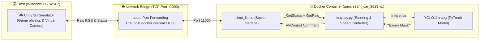
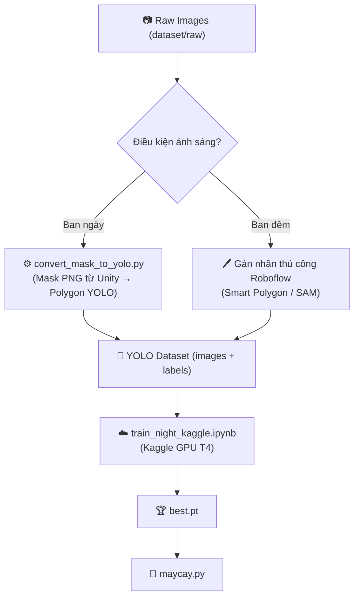

<div align="center">

# 🏁 UIT-CAR-RACING
### Autonomous Navigation & Vision-Based Road Segmentation with YOLO11

[](https://www.python.org/)
[](https://docs.ultralytics.com/)
[](https://pytorch.org/)
[](https://unity.com/)
[](https://www.docker.com/)
[](https://learn.microsoft.com/en-us/windows/wsl/)

<p align="center">
  <b>Hệ thống lái xe tự hành thời gian thực kết hợp giữa mô phỏng Unity 3D, nhận diện làn đường bằng mô hình học sâu YOLO11 phân đoạn (Segmentation) và thuật toán điều khiển lái thích ứng.</b><br>
  <i>Dự án phát triển phục vụ cuộc thi "UIT CAR RACING 2025 MÙA XIV - BẢNG CHUYÊN NGHIỆP" do Khoa Kỹ thuật Máy tính, Trường Đại học Công nghệ Thông tin (ĐHQG-HCM) tổ chức.</i>
</p>

</div>

---

## 📑 Mục lục

* [1. Tính năng Nổi bật](#-1-tính-năng-nổi-bật)
* [2. Kiến trúc Hệ thống](#-2-kiến-trúc-hệ-thống)
* [3. Cấu trúc Dự án](#-3-cấu-trúc-dự-án)
* [4. Yêu cầu & Cài đặt](#-4-yêu-cầu--cài-đặt)
* [5. Hướng dẫn Khởi chạy](#-5-hướng-dẫn-khởi-chạy)
  * [Trường hợp A: Bản đồ Windows (.exe)](#-trường-hợp-a-bản-đồ-windows-exe)
  * [Trường hợp B: Bản đồ Linux Ban đêm (.x86_64 qua WSL2)](#-trường-hợp-b-bản-đồ-linux-ban-đêm-x86_64-qua-wsl2)
* [6. Thu thập Dữ liệu](#-6-thu-thập-dữ-liệu)
* [7. Pipeline Huấn luyện YOLO](#-7-pipeline-huấn-luyện-yolo)
  * [7A. Gán nhãn Ban ngày (có mask Unity)](#-7a-gán-nhãn-ban-ngày-có-mask-unity)
  * [7B. Gán nhãn Ban đêm (Roboflow — bắt buộc)](#-7b-gán-nhãn-ban-đêm-roboflow--bắt-buộc)
  * [7C. Train trên Kaggle GPU](#-7c-train-trên-kaggle-gpu)
* [8. Đóng gói Nộp bài](#-8-đóng-gói-nộp-bài)
* [9. Xử lý Sự cố](#-9-xử-lý-sự-cố)

---

## ✨ 1. Tính năng Nổi bật

* 🎯 **Phân đoạn Làn đường Thời gian thực**: Sử dụng `YOLO11n-seg` suy diễn ~30 FPS trên từng khung hình camera từ Unity.
* 🏆 **Tối đa hóa Điểm số**: Đạt **10 điểm / checkpoint** (gấp đôi so với 5 điểm dùng mask mặc định BTC).
* 🔄 **Thuật toán Lái Thích Ứng Đa tầng**:
  * **Near/Far Point Blending**: Phối hợp sai số điểm gần và điểm xa để bo cua mượt, tốc độ cao đường thẳng.
  * **Lane Width Estimator**: Tự phát hiện giao lộ mở rộng và điều chỉnh trọng số góc lái.
  * **Curvature-based Speed Control**: Tự hãm tốc vào cua, tăng tốc tối đa đường thẳng.
* 🌙 **Hỗ trợ Sa hình Ban đêm**: Chạy trên map `V2_demo` (Linux/WSL2) với điều kiện ánh sáng thấp.
* 🐳 **Đóng gói Docker Chuẩn hóa**: Toàn bộ chạy trong container `quocle28/it_car_2023:v1` (Python 3.8), tương thích hệ thống chấm thi tự động.

---

## 🏛️ 2. Kiến trúc Hệ thống



> [!IMPORTANT]
> **Giao thức Socket bắt buộc**: Vòng lặp chính trong `maycay.py` phải gọi đúng thứ tự `GetStatus()` → `GetRaw()` → `AVControl()`. Thiếu `GetStatus()` sẽ làm phá vỡ handshake và `AVControl()` sẽ im lặng, xe đứng yên.

---

## 📂 3. Cấu trúc Dự án

```text
UIT-CAR-RACING/
├── dataset/
│   ├── raw/
│   │   ├── day/                            # Ảnh thô ban ngày (Demo 1.2)
│   │   └── night/                          # Ảnh thô ban đêm (V2_demo, 1061 ảnh)
│   └── masks/
│       └── night/                          # Mask PNG đối chứng (nếu có)
├── Demo 1.2/
│   └── UCR_Unity.exe                       # Bản đồ Windows ban ngày
├── V2_demo/
│   ├── UCRlinux.x86_64                     # Bản đồ Linux ban đêm
│   ├── UnityPlayer.so
│   └── UCRlinux_Data/
├── Road_Seg_Model/
│   └── modelYolo/weights/
│       ├── best.pt                         # Model đang dùng (thay thế để đổi model)
│       ├── last.pt
│       └── best_day_backup.pt              # Backup model ban ngày gốc
├── training/
│   ├── configs/
│   │   ├── road_seg.yaml
│   │   └── traffic_sign_seg.yaml
│   ├── utils/
│   │   ├── convert_mask_to_yolo.py         # Mask PNG → Polygon YOLO .txt
│   │   ├── prepare_sign_dataset.py         # Auto-label biển báo (SAM + circularity)
│   │   └── auto_label_night.py             # ⚠️ Chỉ dùng khi ảnh đêm CÓ tương phản rõ
│   ├── train_road.py                       # Train làn đường (safe Docker config)
│   ├── train_yolo_signs.py                 # Train biển báo (fliplr=0.0)
│   └── train_night_kaggle.ipynb            # Notebook train trên Kaggle GPU T4
├── client_lib.so                           # C-extension Python 3.8, giao tiếp Unity
├── collect_data.py                         # Thu thập ảnh từ camera Unity
├── maycay.py                               # Bộ điều khiển xe tự hành chính
├── run_maycay.sh                           # Script khởi động nhanh cho V2_demo (WSL2)
├── KNOWLEDGE_BASE.md                       # Báo cáo kỹ thuật toàn diện
└── README.md                               # Tài liệu này
```

---

## 🛠️ 4. Yêu cầu & Cài đặt

### Phần cứng & Phần mềm

| Thành phần | Yêu cầu |
| :--- | :--- |
| OS | Windows 11 (64-bit) + WSL 2 |
| GPU | NVIDIA ≥ 4GB VRAM + Driver mới nhất |
| Công cụ | Docker Desktop for Windows, VS Code |

### Cài đặt môi trường

```powershell
# 1. Cài WSL 2
wsl --install

# 2. Kéo Docker Image của BTC
docker pull quocle28/it_car_2023:v1

# 3. Tạo container mount dự án (chạy 1 lần duy nhất)
docker run --name it-car -it -p 11000:11000 `
  -v ${PWD}:/workspace/UIT-CAR-RACING `
  --shm-size=8G --gpus all `
  quocle28/it_car_2023:v1 /bin/bash
```

Cài thư viện đồ họa WSL2 (để chạy `.x86_64`):
```bash
sudo apt-get update && sudo apt-get install -y \
    libglu1-mesa libgles2-mesa mesa-utils \
    libasound2 libpulse0 libxcursor1 libxrandr2 libxi6
```

---

## 🚀 5. Hướng dẫn Khởi chạy

### 🌟 Trường hợp A: Bản đồ Windows (.exe)

1. Bật `Demo 1.2/UCR_Unity.exe` → chọn độ phân giải → **Play**
2. Mở PowerShell:
   ```powershell
   docker start -ai it-car
   ```
3. Bên trong Docker:
   ```bash
   pkill -9 socat 2>/dev/null; fuser -k 11000/tcp 2>/dev/null; sleep 1
   socat TCP-LISTEN:11000,reuseaddr,fork TCP:host.docker.internal:11000 &
   cd /workspace/UIT-CAR-RACING
   python maycay.py
   ```
4. Chuyển sang Unity → Click **`AV Mode`**

---

### 🌙 Trường hợp B: Bản đồ Linux Ban đêm (.x86_64 qua WSL2)

1. **Terminal WSL2** — Khởi động Unity Linux:
   ```bash
   chmod +x /mnt/d/UIT-CAR-RACING/V2_demo/UCRlinux.x86_64
   SDL_AUDIODRIVER=dummy /mnt/d/UIT-CAR-RACING/V2_demo/UCRlinux.x86_64
   ```

2. **Terminal PowerShell** — Vào Docker:
   ```powershell
   docker start -ai it-car
   ```

3. **Bên trong Docker** — Dùng script tự động (đã có sẵn IP WSL2):
   ```bash
   cd /workspace/UIT-CAR-RACING
   bash run_maycay.sh
   ```
   Hoặc thủ công (thay `<WSL2_IP>` bằng output của `wsl hostname -I`):
   ```bash
   pkill -9 socat 2>/dev/null; fuser -k 11000/tcp 2>/dev/null; sleep 1
   socat TCP-LISTEN:11000,reuseaddr,fork TCP:<WSL2_IP>:11000 &
   python maycay.py
   ```

4. Chuyển sang Unity → Click **`AV Mode`**

> [!TIP]
> Nếu xe không bẻ lái (log `Angle: +0.00`), hãy nhấn phím **`R`** trong Unity để reset xe về vạch xuất phát, sau đó bấm lại `AV Mode`.

---

## 📷 6. Thu thập Dữ liệu

```bash
cd /workspace/UIT-CAR-RACING

# Thu thập ban ngày — lái tay bằng W/A/S/D trong Unity
python collect_data.py --scene day --drive manual --max 1000 --interval 0.3

# Thu thập ban đêm — lái tay trong V2_demo
python collect_data.py --scene night --drive manual --max 1000 --interval 0.3

# Thu thập tự động — xe tự bám làn bằng model hiện tại
python collect_data.py --scene day --drive av --max 1000 --interval 0.3
```

Ảnh được lưu tại `dataset/raw/day/` hoặc `dataset/raw/night/`.

---

## 🚂 7. Pipeline Huấn luyện YOLO



### 🌞 7A. Gán nhãn Ban ngày (có mask Unity)

Unity Simulator xuất kèm ảnh phân đoạn màu tương ứng với mỗi ảnh camera. Dùng script chuyển đổi:

```bash
python training/utils/convert_mask_to_yolo.py \
  --raw_dir dataset/raw/day \
  --mask_dir dataset/masks/day \
  --output_dir /workspace/unet
```

Sau đó train:
```bash
python training/train_road.py
```

---

### 🌙 7B. Gán nhãn Ban đêm (Roboflow — bắt buộc)

> [!WARNING]
> **KHÔNG dùng `auto_label_night.py` cho ảnh V2_demo.** Ảnh ban đêm trong V2_demo có mặt đường **tối hơn** bầu trời/cỏ nên mọi phương pháp threshold tự động đều gán sai nhãn (mask trắng 100% = toàn ảnh). Model train trên dataset sai sẽ không nhận diện được đường.

**Quy trình gán nhãn thủ công chính xác:**

1. Truy cập [roboflow.com](https://roboflow.com) → tạo Project **Instance Segmentation**
2. Upload toàn bộ `dataset/raw/night/`
3. Dùng **Smart Polygon** (phím `S`) — AI tự khoanh viền đường
4. Bật `Contrast Enhancement` để thấy rõ viền đường trong bóng tối
5. Export format **YOLOv8 Segmentation** → tải về

---

### ☁️ 7C. Train trên Kaggle GPU

1. Upload dataset lên [kaggle.com/datasets](https://www.kaggle.com/datasets) dạng `.zip`
2. Tạo Notebook mới → Upload `training/train_night_kaggle.ipynb`
3. Settings: **Accelerator = GPU T4 x2** → Add dataset vừa upload → **Run All**
4. Download `best.pt` từ tab Output
5. Thay thế vào `Road_Seg_Model/modelYolo/weights/best.pt`

**Tham số train tối ưu cho ảnh đêm:**
```python
model.train(
    data='night_road_seg.yaml',
    epochs=60,
    imgsz=640,
    batch=16,
    fliplr=0.0,      # Tắt flip ngang — bảo toàn hướng làn đường
    hsv_v=0.4,       # Tăng cường ngẫu nhiên độ sáng — quan trọng với ảnh đêm
    mosaic=0.5,
    optimizer='AdamW',
    lr0=0.001,
)
```

---

## 📦 8. Đóng gói Nộp bài

```powershell
# 1. Commit container thành Image mới
docker commit it-car uit_car_racing_submission:v1.0

# 2. Xuất ra file .tar
docker save -o uit_car_racing_submission.tar uit_car_racing_submission:v1.0

# 3. Nộp kèm instruction.txt ghi lệnh chạy:
#    python /workspace/UIT-CAR-RACING/maycay.py
```

---

## ⚠️ 9. Xử lý Sự cố

| Triệu chứng | Nguyên nhân | Giải pháp |
| :--- | :--- | :--- |
| `ConnectionRefusedError: [Errno 111]` | Unity chưa chạy hoặc socat chưa bật | Bật Unity trước → chạy lại lệnh socat |
| `undefined symbol: _Py_CheckRecursionLimit` | Chạy `client_lib.so` bằng Python 3.10+ | Chạy bên trong Docker (Python 3.8) |
| `qt.qpa.xcb: could not connect to display` | Docker không có X11 server | Đã tự xử lý — `maycay.py` chạy headless an toàn. Không set `DISPLAY` nếu không dùng XLaunch |
| `qt.qpa.plugin: Could not find "offscreen"` | Bộ OpenCV Docker không có plugin offscreen | `unset QT_QPA_PLATFORM` trước khi chạy `maycay.py` |
| `Address already in use` cổng 11000 | Socket cũ còn ở trạng thái `TIME_WAIT` | Luôn chạy `fuser -k 11000/tcp` trước khi bật socat |
| `Angle: +0.00`, `Error: +0.0` mọi frame | Model không detect được đường (mask trắng hoặc đen toàn ảnh) | Kiểm tra chất lượng dataset — ảnh đêm cần gán nhãn thủ công qua Roboflow |
| Xe đứng yên dù log frame đang chạy | Thiếu `GetStatus()` trong vòng lặp → handshake bị phá vỡ | Đảm bảo thứ tự: `GetStatus()` → `GetRaw()` → `AVControl()` |
| Unity Linux tắt ngay sau 1 giây | Thiếu thư viện OpenGL/Mesa hoặc lỗi audio | Cài `libglu1-mesa`, chạy kèm `SDL_AUDIODRIVER=dummy` |
| Xe chạy không bẻ lái dù model OK | Game không ở AV Mode | Click nút **`AV Mode`** trên màn hình Unity; nếu xe đang giữa đường nhấn `R` để reset |

---

<div align="center">
  <sub>UIT-CAR-RACING • Developed with ❤️ for UIT Autonomous Car Racing 2025</sub>
</div>
