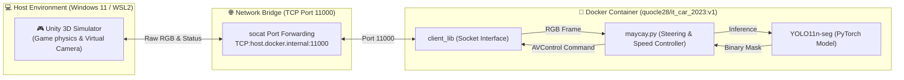
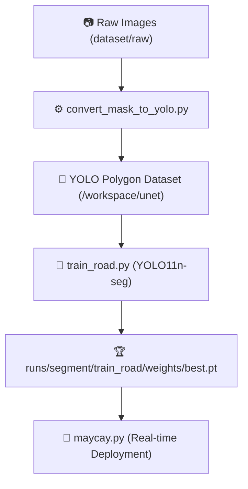

<div align="center">

# 🏁 UIT-CAR-RACING
### Autonomous Navigation & Vision-Based Road Segmentation with YOLO11

[](https://www.python.org/)
[](https://docs.ultralytics.com/)
[](https://pytorch.org/)
[](https://unity.com/)
[](https://www.docker.com/)
[](https://learn.microsoft.com/en-us/windows/wsl/)

<p align="center">
  <b>Hệ thống lái xe tự hành thời gian thực kết hợp giữa mô phỏng Unity 3D, nhận diện làn đường bằng mô hình học sâu YOLO11 phân đoạn (Segmentation) và thuật toán điều khiển lái thích ứng.</b><br>
  <i>Dự án phát triển phục vụ cuộc thi "UIT CAR RACING 2025 MÙA XIV - BẢNG CHUYÊN NGHIỆP" do Khoa Kỹ thuật Máy tính, Trường Đại học Công nghệ Thông tin (ĐHQG-HCM) tổ chức.</i>
</p>

</div>

---

## 📑 Mục lục (Table of Contents)
* [1. Tính năng Nổi bật (Key Features)](#-1-tính-năng-nổi-bật-key-features)
* [2. Kiến trúc Hệ thống (System Architecture)](#-2-kiến-trúc-hệ-thống-system-architecture)
* [3. Cấu trúc Dự án (Project Structure)](#-3-cấu-trúc-dự-án-project-structure)
* [4. Yêu cầu Hệ thống & Cài đặt (Prerequisites & Installation)](#-4-yêu-cầu-hệ-thống--cài-đặt-prerequisites--installation)
* [5. Hướng dẫn Khởi chạy (Quick Start & Usage)](#-5-hướng-dẫn-khởi-chạy-quick-start--usage)
  * [Trường hợp A: Bản đồ Windows (.exe)](#-trường-hợp-a-chạy-bản-đồ-windows-exe-trong-demo-12)
  * [Trường hợp B: Bản đồ Linux Ban đêm (.x86_64 qua WSL)](#-trường-hợp-b-chạy-bản-đồ-linux-ban-đêm-x86_64-trong-v2_demo)
* [6. Thu thập Dữ liệu (Data Collection Pipeline)](#-6-thu-thập-dữ-liệu-data-collection-pipeline)
* [7. Huấn luyện Mô hình YOLO (Training Pipeline)](#-7-huấn-luyện-mô-hình-yolo-training-pipeline)
* [8. Đóng gói Nộp bài Thi đấu (Submission Workflow)](#-8-đóng-gói-nộp-bài-thi-đấu-submission-workflow)
* [9. Xử lý Sự cố Thường gặp (Troubleshooting & FAQs)](#-9-xử-lý-sự-cố-thường-gặp-troubleshooting--faqs)

---

## ✨ 1. Tính năng Nổi bật (Key Features)

* 🎯 **Phân đoạn Làn đường Thời gian thực (Real-time Segmentation)**: Sử dụng mô hình `YOLO11n-seg` được tối ưu hóa siêu tham số, suy diễn thời gian thực trên từng khung hình camera truyền về từ Unity qua Socket.
* 🏆 **Tối đa hóa Điểm số Cuộc thi**: Đạt **10 điểm / checkpoint** (so với 5 điểm nếu dùng mask mặc định của Ban tổ chức) nhờ hệ thống AI tự huấn luyện độc lập.
* 🔄 **Thuật toán Lái Xe Thích Ứng (Adaptive Steering & Speed Control)**:
  * **Near/Far Point Blending**: Kết hợp sai số điểm gần (Near Point - định vị tức thời) và điểm xa (Far Point - đón đầu khúc cua) giúp xe bo cua mượt mà và chạy tốc độ cao trên đường thẳng.
  * **Lane Width Estimator**: Tự động ước lượng độ rộng mặt đường để phát hiện giao lộ mở rộng và điều chỉnh trọng số góc bẻ lái thích hợp.
* 🌙 **Khả năng Vượt Sa hình Đa dạng**: Hỗ trợ xử lý đường cua quanh co, thay đổi điều kiện ánh sáng và đường tối ban đêm (`V2_demo`).
* 🐳 **Môi trường Đóng gói Chuẩn hóa**: Toàn bộ mã nguồn điều khiển chạy trong Docker Container (`Python 3.8`), tương thích hoàn toàn với nền tảng chấm thi tự động của Ban tổ chức.

---

## 🏛️ 2. Kiến trúc Hệ thống (System Architecture)



---

## 📂 3. Cấu trúc Dự án (Project Structure)

```text
UIT-CAR-RACING/
├── dataset/                                # Dữ liệu huấn luyện
│   └── raw/
│       ├── day/                            # Ảnh thô thu thập ban ngày
│       └── night/                          # Ảnh thô thu thập ban đêm (V2_demo)
├── Demo 1.2/                               # Bản đồ mô phỏng Unity dành cho Windows
│   └── UCR_Unity.exe                       # File thực thi game (.exe)
├── V2_demo/                                # Bản đồ mô phỏng Unity dành cho Linux
│   ├── UCRlinux.x86_64                     # File thực thi game (.x86_64)
│   ├── UnityPlayer.so                      # Thư viện đồ họa Unity Linux
│   └── UCRlinux_Data/                      # Dữ liệu cảnh 3D
├── Road_Seg_Model/                         # Mô hình phân đoạn làn đường
│   ├── modelYolo/                          # Checkpoint & kết quả huấn luyện
│   │   ├── weights/
│   │   │   ├── best.pt                     # Trọng số tốt nhất đang chạy trong maycay.py
│   │   │   └── last.pt                     # Trọng số epoch cuối cùng
│   │   └── results.png                     # Đồ thị huấn luyện & mAP
│   └── yolo_model                          # Mô hình phụ trợ
├── training/                               # Bộ công cụ huấn luyện YOLO độc lập
│   ├── configs/                            # Cấu hình tập dữ liệu YAML
│   │   ├── road_seg.yaml                   # Cấu hình tập dữ liệu Làn đường
│   │   └── traffic_sign_seg.yaml           # Cấu hình tập dữ liệu Biển báo
│   ├── utils/                              # Công cụ tiền xử lý & tự động dán nhãn
│   │   ├── __init__.py                     # Khai báo package
│   │   ├── convert_mask_to_yolo.py         # Trích xuất contour mask sang Polygon YOLO
│   │   └── prepare_sign_dataset.py         # Tự động gán nhãn biển báo (SAM + lọc tròn)
│   ├── train_road.py                       # Script train phân đoạn đường (chống crash Docker)
│   └── train_yolo_signs.py                 # Script train biển báo (tắt lật ngang fliplr=0.0)
├── client_lib.so                           # Thư viện Socket client CPython 3.8 giao tiếp Unity
├── collect_data.py                         # Công cụ chụp và lưu ảnh tự động từ camera Unity
├── maycay.py                               # Mã nguồn Python điều khiển xe tự hành chính
└── README.md                               # [TÀI LIỆU NÀY] Tài liệu hướng dẫn dự án chuẩn GitHub
```

---

## 🛠️ 4. Yêu cầu Hệ thống & Cài đặt (Prerequisites & Installation)

### Yêu cầu Phần cứng & Phần mềm
* **Hệ điều hành**: Windows 11 (64-bit) với WSL 2 kích hoạt.
* **GPU**: NVIDIA GPU (Khuyến nghị VRAM $\ge$ 4GB) + NVIDIA Driver mới nhất.
* **Công cụ**: Docker Desktop for Windows, Visual Studio Code.

### Quy trình Cài đặt Môi trường (Step-by-step Setup)

```powershell
# 1. Cài đặt WSL 2 trên Windows 11 (Mở PowerShell quyền Administrator)
wsl --install

# 2. Cài đặt Docker Desktop và kiểm tra cài đặt
docker --version

# 3. Kéo Docker Image chính thức của Ban tổ chức
docker pull quocle28/it_car_2023:v1

# 4. Khởi tạo container 'it-car' mount mã nguồn dự án và kích hoạt GPU
docker run --name it-car -it -p 11000:11000 -v ${PWD}:/workspace/UIT-CAR-RACING --shm-size=8G --gpus all quocle28/it_car_2023:v1 /bin/bash
```

Cài đặt thư viện đồ họa phụ trợ cho **WSL2** (để chạy bản đồ Linux `.x86_64`):
```bash
# Mở terminal WSL (gõ 'wsl' trong PowerShell) và chạy:
sudo apt-get update && sudo apt-get install -y \
    libglu1-mesa libgles2-mesa mesa-utils \
    libasound2 libpulse0 libxcursor1 libxrandr2 libxi6
```

---

## 🚀 5. Hướng dẫn Khởi chạy (Quick Start & Usage)

### 🌟 Trường hợp A: Chạy Bản đồ Windows (.exe trong `Demo 1.2`)

1. **Khởi động Game Unity**:
   * Mở thư mục `Demo 1.2` $\rightarrow$ Nhấp đúp vào `UCR_Unity.exe`.
   * Chọn độ phân giải $\rightarrow$ Nhấn **Play**.
2. **Khởi động Controller trong Docker**:
   Mở PowerShell trên Windows và chạy cụm lệnh:
   ```powershell
   docker start -ai it-car
   ```
   Bên trong terminal Docker, dán lệnh:
   ```bash
   pkill -9 socat 2>/dev/null; fuser -k 11000/tcp 2>/dev/null; sleep 1
   socat TCP-LISTEN:11000,reuseaddr,fork TCP:host.docker.internal:11000 &
   cd /workspace/UIT-CAR-RACING
   python maycay.py
   ```
3. **Bắt đầu Lái**: Chuyển sang Unity $\rightarrow$ Click nút **`AV Mode`** để xe tự động chạy.

---

### 🌙 Trường hợp B: Chạy Bản đồ Linux Ban đêm (.x86_64 trong `V2_demo`)

1. **Terminal 1 (WSL) — Khởi động Unity Linux**:
   ```bash
   chmod +x /mnt/d/UIT-CAR-RACING/V2_demo/UCRlinux.x86_64
   SDL_AUDIODRIVER=dummy /mnt/d/UIT-CAR-RACING/V2_demo/UCRlinux.x86_64
   ```
2. **Terminal 2 (PowerShell) — Khởi động Controller trong Docker**:
   ```powershell
   docker start -ai it-car
   ```
   Bên trong Docker, chạy:
   ```bash
   pkill -9 socat 2>/dev/null; fuser -k 11000/tcp 2>/dev/null; sleep 1
   socat TCP-LISTEN:11000,reuseaddr,fork TCP:host.docker.internal:11000 &
   cd /workspace/UIT-CAR-RACING
   python maycay.py
   ```
3. **Bắt đầu Lái**: Click nút **`AV Mode`** trên màn hình Unity.

---

## 📷 6. Thu thập Dữ liệu (Data Collection Pipeline)

Sử dụng công cụ `collect_data.py` để tự động lưu ảnh camera RGB phục vụ huấn luyện:

```bash
cd /workspace/UIT-CAR-RACING

# 1. Thu thập dữ liệu ban ngày (Lái tay bằng phím W/A/S/D trong Unity)
python collect_data.py --scene day --drive manual --max 1000 --interval 0.3

# 2. Thu thập dữ liệu ban đêm (Lái tay trong map V2_demo)
python collect_data.py --scene night --drive manual --max 1000 --interval 0.3

# 3. Thu thập dữ liệu tự động (Xe tự bám làn bằng model hiện tại)
python collect_data.py --scene day --drive av --max 1000 --interval 0.3
```

> [!TIP]
> Ảnh chụp sẽ tự động được lưu trữ tại `dataset/raw/day/` hoặc `dataset/raw/night/`. Bạn có thể theo dõi tiến độ lưu ảnh trực tiếp trên thanh Progress Bar ở Terminal.

---

## 🚂 7. Huấn luyện Mô hình YOLO (Training Pipeline)



### Bước 1: Tiền xử lý Dữ liệu & Trích xuất Polygon Masks
```bash
# Chuyển đổi mặt nạ làn đường sang định dạng YOLO Segmentation đa giác
python training/utils/convert_mask_to_yolo.py \
  --raw_dir dataset/raw/day \
  --mask_dir dataset/masks/day \
  --output_dir /workspace/unet

# Tạo tập dữ liệu biển báo giao thông với Segment Anything Model (SAM)
python training/utils/prepare_sign_dataset.py \
  --raw_dir dataset/raw/signs \
  --mask_dir dataset/masks/signs \
  --output_dir /workspace/signtrain
```

### Bước 2: Khởi chạy Huấn luyện (Training)
```bash
# Huấn luyện mô hình Phân đoạn Làn đường (Cấu hình chống crash Docker)
python training/train_road.py

# Huấn luyện mô hình Biển báo Giao thông (Tắt lật ngang fliplr=0.0)
python training/train_yolo_signs.py
```

---

## 📦 8. Đóng gói Nộp bài Thi đấu (Submission Workflow)

Quy trình xuất bản tệp nén Docker Image nộp cho Ban tổ chức chấm thi:

```powershell
# 1. Tại PowerShell trên Windows Host, lưu container thành Image mới:
docker commit it-car uit_car_racing_submission:v1.0

# 2. Xuất Image ra tệp nén .tar vật lý:
docker save -o uit_car_racing_submission.tar uit_car_racing_submission:v1.0

# 3. Chuẩn bị file instruction.txt ghi chú lệnh chạy:
#    "python /workspace/UIT-CAR-RACING/maycay.py"
```

---

## ⚠️ 9. Xử lý Sự cố Thường gặp (Troubleshooting & FAQs)

| Vấn đề | Nguyên nhân | Giải pháp |
| :--- | :--- | :--- |
| `ConnectionRefusedError: [Errno 111]` | Unity chưa chạy hoặc `socat` chưa bật. | Bật game Unity trước, sau đó chạy: `pkill -9 socat; fuser -k 11000/tcp; sleep 1` rồi bật lại `socat TCP-LISTEN:11000,reuseaddr,fork TCP:host.docker.internal:11000 &`. |
| `ImportError: undefined symbol: _Py_CheckRecursionLimit` | Chạy `client_lib.so` bằng Python 3.10+ ngoài WSL. | Chạy code Python bên trong **Docker Container `it-car`** (nơi có môi trường chuẩn Python 3.8). |
| `The container does not meet all requirements of VS Code Server` | VS Code phiên bản mới không tương thích Ubuntu 18.04 cũ. | Không cần Attach VS Code. Mở code sửa trực tiếp trên VS Code Windows và mở Terminal gõ `docker start -ai it-car` để chạy. |
| `qt.qpa.xcb: could not connect to display` | OpenCV cố mở cửa sổ GUI Qt trong Docker không có X11. | `maycay.py` và `collect_data.py` đã được tích hợp cờ `offscreen` tự động, hoạt động an toàn ở chế độ headless. |
| `Address already in use` trên cổng 11000 | Socket cũ còn lưu trạng thái `TIME_WAIT`. | Luôn thêm cờ `reuseaddr` vào lệnh socat: `socat TCP-LISTEN:11000,reuseaddr,fork ...`. |

---

<div align="center">
  <sub>UIT-CAR-RACING • Developed with ❤️ for UIT Autonomous Car Racing 2025</sub>
</div>
